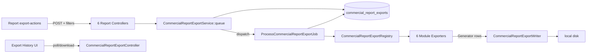

# PHASE CR-7 — Commercial Reports Export Framework

## Implementation Report

**Module:** Commercial → Reports → Export Framework  
**Route:** `commercial.reports.exports.index`  
**Scope:** Reusable queued export pipeline for all six commercial report groups — does not rebuild report workspaces.

---

## Readiness Table (Required First)

Displayed at the top of **Export History** before the export list.

| Source | Table / Component | Status Check |
|--------|-------------------|--------------|
| Export registry | `framework` | Six module exporters registered |
| Export storage | `local` | Writable `exports/` path on local disk |
| Export queue | `exports` | Queue connection is not `sync` |
| Export records | `commercial_report_exports` | Table + required columns exist |

**Service:** `App\Support\Commercial\Reports\Exports\CommercialReportExportReadiness`  
**View:** Reuses `resources/views/admin/commercial/reports/sales/partials/readiness-table.blade.php`

---

## Architecture



### Design principles

- **One job, many exporters** — `ProcessCommercialReportExportJob` handles all modules.
- **No duplicate export logic** — per-module jobs removed; exporters delegate to existing query services.
- **Queued only** — exports always `dispatch()` to the `exports` queue (no synchronous path).
- **Filters preserved** — full `scope_payload` JSON stored on each export row.
- **Chunked reads** — paginated tabs stream page-by-page via `CommercialReportExportPaginator`.
- **Streaming writes** — `CommercialReportExportWriter` writes row-by-row to a temp stream, then `writeStream()` to disk.

---

## Database

**Table:** `commercial_report_exports` (migrated from `report_exports`)

| Column | Purpose |
|--------|---------|
| `company_id`, `user_id` | Tenant + who generated the export |
| `module`, `tab`, `format` | Report context |
| `scope_payload` | Serialized filters (dates, branch, customer, etc.) |
| `status` | `queued`, `processing`, `completed`, `failed`, `expired` |
| `storage_path`, `filename`, `mime_type` | Downloadable artifact |
| `row_count` | Rows written |
| `error_message` | Failure logging |
| `queued_at`, `completed_at`, `expires_at` | Lifecycle timestamps |

**Migration:** `database/migrations/2026_06_21_100000_upgrade_commercial_report_exports_table.php`

---

## Core Classes

| Class | Responsibility |
|-------|----------------|
| `CommercialReportExport` | Eloquent model |
| `CommercialReportExportStatus` | Enum: Queued, Processing, Completed, Failed, Expired |
| `CommercialReportExportService` | Queue export, authorize view/download |
| `CommercialReportExportRegistry` | Maps module → exporter class |
| `CommercialReportExportWriter` | Stream CSV / Excel (TSV) / PDF (HTML) output |
| `CommercialReportExportPaginator` | Page-by-page row streaming |
| `ProcessCommercialReportExportJob` | Queue worker entry point |
| `ExpireCommercialReportExports` | Daily cleanup command |
| `CommercialReportExportController` | History, status JSON, download |

### Module exporters (`app/Support/Commercial/Reports/Exports/Exporters/`)

| Exporter | Module key |
|----------|------------|
| `SalesReportExporter` | `sales` |
| `QuotationReportExporter` | `quotations` |
| `SalesOrderReportExporter` | `sales_orders` |
| `CustomerReportExporter` | `customers` |
| `ArtworkReportExporter` | `artwork` |
| `ConversionReportExporter` | `conversion` |

---

## Routes

| Method | URI | Name | Permission |
|--------|-----|------|------------|
| GET | `/admin/commercial/reports/exports` | `commercial.reports.exports.index` | `commercial.reports.exports.view` |
| GET | `/admin/commercial/reports/exports/{export}/download` | `commercial.reports.exports.download` | `commercial.reports.exports.download` |
| GET | `/admin/commercial/reports/exports/{export}/status` | `commercial.reports.exports.status` | `commercial.reports.exports.view` |
| POST | `/admin/commercial/reports/{module}/export` | `commercial.reports.*.export` | `commercial.reports.export` |

**File:** `routes/admin_commercial.php`

---

## Permissions

| Permission | Purpose |
|------------|---------|
| `commercial.reports.export` | Queue exports from any commercial report workspace |
| `commercial.reports.exports.view` | Export History page + status polling |
| `commercial.reports.exports.download` | Download completed files |

Seeded in `RolesAndPermissionsSeeder` for Admin and Manager roles. Per-module `.export` permissions retained for backward compatibility in the catalog but routes use the framework permission.

---

## UI

| Surface | Path |
|---------|------|
| Export buttons | Existing `export-actions.blade.php` on all 6 report workspaces |
| Export status banner | `resources/views/admin/commercial/reports/partials/export-status.blade.php` |
| Export History | `resources/views/admin/commercial/reports/exports/index.blade.php` |
| Status badges | `resources/views/admin/commercial/reports/exports/partials/status-badge.blade.php` |
| Navigation | Commercial → Reports → **Export History** in `config/commercial_workspaces.php` |

---

## Configuration

`config/platform.php`:

```php
'commercial_reports' => [
    'export_ttl_days' => env('COMMERCIAL_REPORT_EXPORT_TTL_DAYS', 7),
],
```

---

## Operations

### Queue worker (required)

```bash
php artisan queue:work --queue=exports
```

### Expire old exports (scheduled daily)

```bash
php artisan commercial:expire-report-exports
```

Registered in `bootstrap/app.php` via `->withSchedule()`.

---

## Removed (replaced by framework)

- `ExportCommercial*ReportJob` (6 per-module jobs)
- `ReportExport` model / `ReportExportStatus` enum
- `CompletesReportExport` trait
- Synchronous `dispatch_sync()` export path
- `COMMERCIAL_REPORT_ASYNC_EXPORTS` env flag

---

## Tests

| Test file | Coverage |
|-----------|----------|
| `CommercialReportExportFrameworkTest` | History access, queue dispatch, job file output, download |
| `Commercial*ReportTest` (×6) | Export permission + queue dispatch per module |

Run:

```bash
php artisan test tests/Feature/Commercial/
```

---

## Supported formats

| Format | Output | MIME |
|--------|--------|------|
| CSV | `.csv` | `text/csv` |
| Excel | `.xls` (UTF-8 TSV) | `application/vnd.ms-excel` |
| PDF | `.html` (printable) | `text/html` |

---

## Status lifecycle

1. **Queued** — record created, job dispatched
2. **Processing** — worker started
3. **Completed** — file on disk, download available until `expires_at`
4. **Failed** — `error_message` logged, visible in history
5. **Expired** — file removed, status updated by scheduled command
