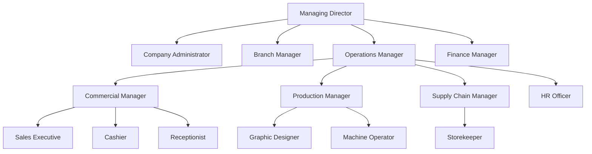

# PHASE ORG-1 — Job Titles & Reporting Structure

## Readiness Table

| Module | Job Titles & Reporting Structure |
|--------|----------------------------------|
| **Tables Affected** | `job_titles` (new), `employees.job_title_id` (new FK), `employees.designation` (retained) |
| **Routes Affected** | `admin.job-titles.*`, `admin.employees.*` (form field), `admin.governance.chains.*` (authority reference) |
| **Services Needed** | `JobTitleService` (hierarchy, deactivation guards, designation sync, approval mapping) |
| **Permissions Needed** | `organization.job_titles.view`, `.create`, `.edit`, `.deactivate` |
| **Indexes Needed** | `job_titles_company_code_unique`, `job_titles_company_active_sort_idx`, `job_titles_company_department_idx`, `job_titles_company_reports_idx`, `employees_company_job_title_idx` |
| **Risks** | Legacy `designation` free-text retained; backfill may miss non-standard labels; deactivation blocked when employees/reporting children exist |
| **Tests Required** | Create, edit, deactivate, employee assign, reporting structure, hierarchy render, permissions |

## Existing Employee Designation Analysis

| Finding | Detail |
|---------|--------|
| **Current field** | `employees.designation` — nullable string (free text) |
| **No normalized title** | No `job_title_id` existed before ORG-1 |
| **Seeded examples** | Super Administrator, Company Administrator, Branch Manager, Sales Representative |
| **CRM/Procurement** | Separate `job_title` on customer/vendor contacts — unrelated to internal org |
| **Approval chains** | Use Spatie **security roles** (`approver_role`), not employee designation |
| **Migration strategy** | Add `job_title_id`; backfill from matching `designation` → `job_titles.title`; keep `designation` synced from selected title for backward compatibility |

## Organization Hierarchy Diagram

## Production Gate

| Check | Status |
|-------|--------|
| Migration | Yes |
| Seeded titles | Yes |
| Employee FK + backfill | Yes |
| Workspace tile active | Yes |
| Organization chart | Yes |
| Approval authority exposure | Yes |
| Feature tests | Yes |

**PRODUCTION GATE ARMORED: STANDING BY FOR LEAN ENGINEERING INPUTS.**
