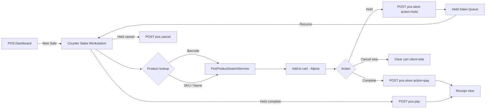

# PHASE POS-1A — Counter Sales Workspace Foundation

## Readiness Table

| Dimension | Detail |
|-----------|--------|
| **Module** | Commercial → Point of Sale → Counter Sales Workstation |
| **Tables Affected** | None (uses existing `pos_sales`, `pos_sale_items`, `pos_sale_holds`, `pos_payments`, `inventory_items`, `customers`) |
| **Routes Affected** | `admin.commercial.pos.counter-sales`, `admin.commercial.pos.counter-sales.products.search`, `admin.commercial.pos.create` (redirect), `admin.commercial.pos.resume` (workstation view), existing `store` / `pay` / `cancel` / `receipt` |
| **Services Needed** | `PosProductSearchService` (barcode/SKU/name), existing `PosSaleService`, `PosSaleCalculator`, `PosSessionService` |
| **Permissions Needed** | `pos.counter_sales.view`, `pos.counter_sales.create`, `pos.counter_sales.hold`, `pos.counter_sales.complete`, `pos.counter_sales.cancel` (legacy `pos.*` retained as fallback) |
| **Indexes Needed** | None new — search uses existing `inventory_items.sku`, `item_code`, `item_name` with tenant scope |
| **Risks** | Split payment is UI-only placeholder; thermal printer not integrated; `standard_cost` used as retail price until price list phase |
| **Tests Required** | `PosCounterSalesWorkstationTest` — create, search, qty, hold, resume, complete, cancel, receipt, permissions |

## Workflow

## Out of Scope (POS-1A)

- Returns, reconciliation, certification, intelligence
- Accounting / production changes
- Full split-payment engine
- Thermal printer integration
