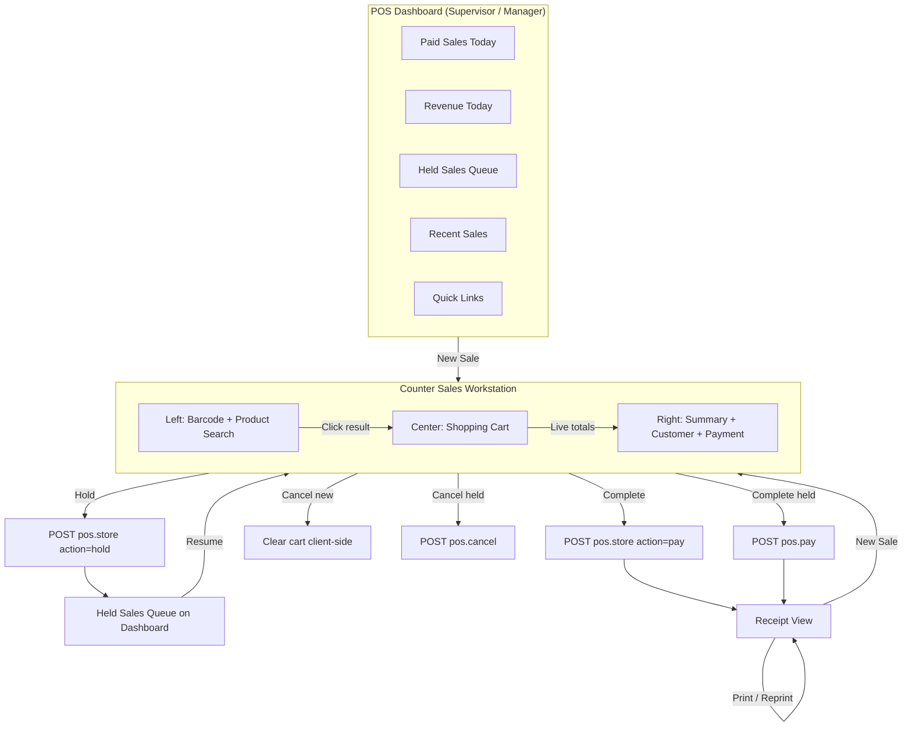

# PHASE POS-1A — Counter Sales Workspace Foundation

## 1. Readiness Table

| Module | Tables Affected | Routes Affected | Services Needed | Permissions Needed | Indexes Needed | Risks | Tests Required |
|--------|-----------------|-----------------|-----------------|-------------------|----------------|-------|----------------|
| Commercial → POS → Counter Sales Workstation | None new — uses `pos_sales`, `pos_sale_items`, `pos_sale_holds`, `pos_payments`, `inventory_items`, `customers` | `admin.commercial.pos.counter-sales`, `admin.commercial.pos.counter-sales.products.search`, `admin.commercial.pos.create` (redirect), `admin.commercial.pos.store`, `admin.commercial.pos.resume`, `admin.commercial.pos.pay`, `admin.commercial.pos.cancel`, `admin.commercial.pos.receipt` | `PosProductSearchService`, `PosSaleService`, `PosSaleCalculator`, `PosSessionService` | `pos.counter_sales.view`, `pos.counter_sales.create`, `pos.counter_sales.hold`, `pos.counter_sales.complete`, `pos.counter_sales.cancel` (+ legacy `pos.*` fallback) | None new — search uses existing `inventory_items.sku`, `item_code`, `item_name` with tenant scope | Split payment is UI placeholder only; thermal printer not integrated; `standard_cost` used as retail price until price-list phase; cart state is client-side (Alpine) until submit | `PosCounterSalesWorkstationTest` — workstation load, product search, create/complete, qty, multi-item, hold, resume, complete held, cancel held, receipt, permissions, new-sale redirect |

## 2. Files Created

| File | Purpose |
|------|---------|
| `app/Http/Controllers/Admin/Commercial/PosCounterSalesController.php` | Workstation index + lazy product search JSON |
| `app/Support/Commercial/PosProductSearchService.php` | Barcode / SKU / name product lookup |
| `resources/views/admin/commercial/pos/counter-sales.blade.php` | Three-column cashier workstation UI |
| `resources/views/admin/commercial/pos/partials/counter-sales-script.blade.php` | Alpine.js cart, search, totals, payment hooks |
| `tests/Feature/Commercial/PosCounterSalesWorkstationTest.php` | Full POS-1A feature test suite |
| `docs/PHASE_POS1A_COUNTER_SALES_WORKSPACE.md` | Phase documentation |

## 3. Files Modified

| File | Change |
|------|--------|
| `routes/admin_commercial.php` | Counter-sales routes + permission gates |
| `app/Http/Controllers/Admin/Commercial/PosSaleController.php` | `create()` redirects to workstation; `resume()` renders workstation; store/pay/cancel/receipt wired |
| `app/Policies/PosSalePolicy.php` | `counterSalesView`, `hold`, `completeSale`, `cancelSale` policy methods |
| `database/seeders/RolesAndPermissionsSeeder.php` | `pos.counter_sales.*` permissions + role assignments |
| `config/permission_catalog.php` | Permission catalog entries |
| `resources/views/admin/commercial/pos/dashboard.blade.php` | **New Sale** → counter-sales (dashboard retained) |
| `resources/views/admin/commercial/pos/index.blade.php` | **New Sale** → counter-sales |
| `resources/views/admin/commercial/pos/receipt.blade.php` | Print / reprint + new sale link |

## 4. Routes Added

| Method | Path | Route Name | Permission |
|--------|------|------------|------------|
| GET | `/admin/commercial/pos/counter-sales` | `admin.commercial.pos.counter-sales` | `pos.view` \| `pos.counter_sales.view` |
| GET | `/admin/commercial/pos/counter-sales/products/search` | `admin.commercial.pos.counter-sales.products.search` | `pos.view` \| `pos.counter_sales.view` |
| GET | `/admin/commercial/pos/new` | `admin.commercial.pos.create` | `pos.create` \| `pos.counter_sales.create` → **redirects to counter-sales** |

Existing routes reused:

| Method | Path | Route Name | POS-1A Role |
|--------|------|------------|-------------|
| POST | `/admin/commercial/pos/sales` | `admin.commercial.pos.store` | New sale hold / complete |
| GET | `/admin/commercial/pos/sales/{sale}/resume` | `admin.commercial.pos.resume` | Resume held sale → workstation |
| POST | `/admin/commercial/pos/sales/{sale}/pay` | `admin.commercial.pos.pay` | Complete held sale |
| POST | `/admin/commercial/pos/sales/{sale}/cancel` | `admin.commercial.pos.cancel` | Cancel held sale |
| GET | `/admin/commercial/pos/sales/{sale}/receipt` | `admin.commercial.pos.receipt` | Post-checkout receipt |

## 5. Permissions Added

| Permission | Purpose |
|------------|---------|
| `pos.counter_sales.view` | Open workstation + product search |
| `pos.counter_sales.create` | Start new sale / POST store |
| `pos.counter_sales.hold` | Hold sale action |
| `pos.counter_sales.complete` | Complete / pay sale |
| `pos.counter_sales.cancel` | Cancel held sale |

Assigned to: **Super Admin**, **Branch Manager**, **Sales** (legacy `pos.view`, `pos.create`, `pos.edit`, `pos.cancel` retained as fallback).

## 6. Services Added

| Service | Responsibility |
|---------|----------------|
| `PosProductSearchService` | Barcode exact match (`sku` / `item_code`); SKU + name fuzzy search; tenant-scoped; limit 15; no N+1 |
| `PosSaleService` | Persist sale, items, holds, payments (existing — extended for workstation payload) |
| `PosSaleCalculator` | Live subtotal / discount / tax / grand total (existing) |
| `PosSessionService` | Active session gate; require open session before checkout (existing) |

## 7. Tests Added

`tests/Feature/Commercial/PosCounterSalesWorkstationTest.php` — **13 tests, all passing**

| Test | Coverage |
|------|----------|
| `test_counter_sales_workstation_loads` | Page renders cart, barcode, summary |
| `test_product_search_by_name` | SKU / name search JSON |
| `test_product_search_by_barcode` | Barcode exact match JSON |
| `test_create_sale_add_item_and_complete` | POST store → paid |
| `test_update_quantity_on_complete_sale` | Qty × price totals |
| `test_add_multiple_items_to_sale` | Multi-line cart checkout |
| `test_hold_sale` | Hold → `pos_sale_holds` |
| `test_resume_held_sale` | Resume → workstation |
| `test_complete_held_sale` | Pay held → paid |
| `test_cancel_held_sale` | Cancel → cancelled |
| `test_receipt_generation` | Receipt number, items, cashier, print/reprint |
| `test_permission_enforcement` | 403 without counter-sales perms |
| `test_new_sale_route_redirects_to_counter_sales` | `pos.create` redirect |

## 8. Final Workflow Diagram

### Workstation Layout

| Zone | Features |
|------|----------|
| **Left** | Barcode scan (enter key), SKU/name search (debounced 300ms), click-to-add — no reload, no modal |
| **Center** | Cart table: Product, Qty (+/−/edit), Unit Price, Discount, Tax, Line Total, Remove |
| **Right** | Subtotal / Discount / Tax / Grand Total, order discount/tax, walk-in default customer, select/add customer, payment method buttons (Cash, M-Pesa, Card, Bank, Split placeholder), Hold / Cancel / Complete |

### Sale States

`draft` → `held` → `paid` | `cancelled` (no `pending` status)

### Out of Scope (POS-1A)

Returns, reconciliation, certification, POS intelligence, accounting changes, production changes, full split-payment engine, thermal printer integration.

---

**PRODUCTION GATE ARMORED:**
STANDING BY FOR LEAN ENGINEERING INPUTS.
