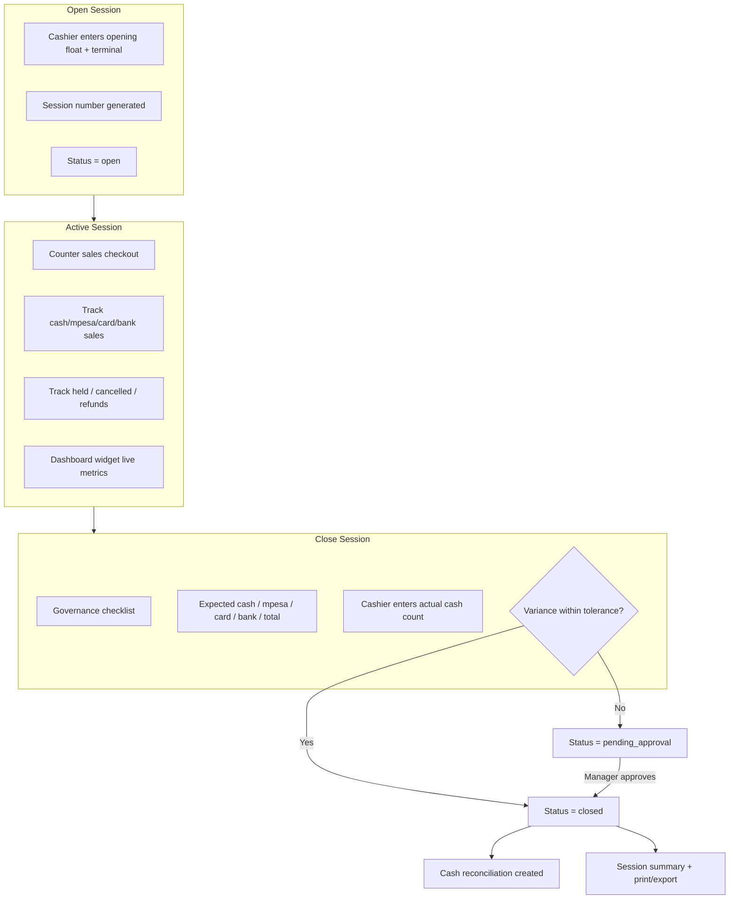

# PHASE POS-1B — Cashier Sessions & Shift Control

## 1. Readiness Table

| Module | Tables Affected | Routes Affected | Services Needed | Permissions Needed | Indexes Needed | Risks | Tests Required |
|--------|-----------------|-----------------|-----------------|-------------------|----------------|-------|----------------|
| Commercial → POS → Cashier Sessions | `pos_sessions` (extended: terminal, expected_mpesa/card/bank/total, variance_requires_approval, variance_approved_by/at) | `pos.sessions.*`, `pos.sessions.summary`, `pos.sessions.export`, `pos.sessions.approve-variance` | `PosSessionService`, `PosSessionCalculator`, `PosSessionValidationService`, `PosSessionVarianceService` | `pos.sessions.view/open/close/approve_variance/export` (+ legacy `commercial.pos.sessions.*`) | Existing: `pos_sessions_cashier_active_idx`, `pos_sessions_scope_status_idx`, `pos_sales_session_status_idx` | Variance tolerance default KES 100 via `config/pos.php`; reconciliation auto-created only after `closed` (not `pending_approval`) | `PosSessionShiftControlTest`, `PosSessionTest`, `PosSessionClosureGovernanceTest`, `PosCounterSalesWorkstationTest` |

## 2. Files Created

| File | Purpose |
|------|---------|
| `config/pos.php` | Variance tolerance + default terminal |
| `database/migrations/2026_06_26_100000_extend_pos_sessions_for_shift_control.php` | Session shift-control columns |
| `app/Support/Commercial/PosSessionCalculator.php` | Aggregate metrics, expected cash/payments |
| `app/Support/Commercial/PosSessionValidationService.php` | Duplicate session, checkout gates, closure governance |
| `app/Support/Commercial/PosSessionVarianceService.php` | Variance calc, tolerance, manager approval |
| `resources/views/admin/commercial/pos/partials/session-widget.blade.php` | POS dashboard current-session widget |
| `resources/views/admin/commercial/pos/sessions/summary.blade.php` | Printable session summary |
| `resources/views/admin/commercial/pos/sessions/partials/summary-body.blade.php` | Summary content partial |
| `resources/views/admin/commercial/pos/sessions/exports/summary-pdf.blade.php` | HTML/PDF export template |
| `tests/Feature/Commercial/PosSessionShiftControlTest.php` | POS-1B feature test suite |
| `docs/PHASE_POS1B_CASHIER_SESSIONS_SHIFT_CONTROL.md` | Phase documentation |

## 3. Files Modified

| File | Change |
|------|--------|
| `app/Enums/PosSessionStatus.php` | Added `closing`, `pending_approval` |
| `app/Models/Pos/PosSession.php` | New fields + `varianceApprover` relation |
| `app/Support/Commercial/PosSessionService.php` | Delegates to calculator/validation/variance services |
| `app/Http/Controllers/Admin/Commercial/PosSessionController.php` | Summary, export, variance approval, terminal on open |
| `app/Http/Controllers/Admin/Commercial/PosSaleController.php` | Dashboard session widget data |
| `app/Policies/PosSessionPolicy.php` | `pos.sessions.*` + approve/export gates |
| `routes/admin_commercial.php` | New routes + dual permission middleware |
| `database/seeders/RolesAndPermissionsSeeder.php` | `pos.sessions.*` permissions |
| `config/permission_catalog.php` | Permission catalog entries |
| `resources/views/admin/commercial/pos/dashboard.blade.php` | Session widget |
| `resources/views/admin/commercial/pos/sessions/create.blade.php` | Terminal field |
| `resources/views/admin/commercial/pos/sessions/close.blade.php` | Full expected breakdown + live variance |
| `resources/views/admin/commercial/pos/sessions/show.blade.php` | Pending approval UI, extended KPIs |
| `resources/views/admin/commercial/pos/counter-sales.blade.php` | Session gate message |
| `tests/Feature/Commercial/PosSessionTest.php` | Close within tolerance |
| `tests/Feature/Commercial/PosCounterSalesWorkstationTest.php` | Checkout without session blocked |

## 4. Routes Added

| Method | Path | Route Name | Permission |
|--------|------|------------|------------|
| GET | `/admin/commercial/pos/sessions/{session}/summary` | `admin.commercial.pos.sessions.summary` | `pos.sessions.view` \| `commercial.pos.sessions.view` |
| GET | `/admin/commercial/pos/sessions/{session}/export` | `admin.commercial.pos.sessions.export` | `pos.sessions.export` \| `commercial.pos.sessions.audit` |
| POST | `/admin/commercial/pos/sessions/{session}/approve-variance` | `admin.commercial.pos.sessions.approve-variance` | `pos.sessions.approve_variance` \| `commercial.pos.sessions.audit` |

Existing routes updated with dual `pos.sessions.*` \| `commercial.pos.sessions.*` middleware.

## 5. Permissions Added

| Permission | Purpose |
|------------|---------|
| `pos.sessions.view` | View sessions, summary |
| `pos.sessions.open` | Open cashier shift |
| `pos.sessions.close` | Close shift + cash count |
| `pos.sessions.approve_variance` | Approve over-tolerance variance |
| `pos.sessions.export` | Export session summary (HTML/PDF) |

Legacy `commercial.pos.sessions.*` retained as fallback.

## 6. Services Added

| Service | Responsibility |
|---------|----------------|
| `PosSessionCalculator` | `sessionMetrics()`, `expectedClosingCash()`, `dashboardStats()` — aggregate queries, no N+1 |
| `PosSessionValidationService` | Duplicate session lock, `requireOpenSession()`, closure governance checklist |
| `PosSessionVarianceService` | Variance calc, tolerance check (`config('pos.cash_variance_tolerance')`), approval |
| `PosSessionService` | Orchestrates open/close/approve; `currentCashierSessionWidget()` for dashboard |

## 7. Tests Added

`PosSessionShiftControlTest` — **11 tests**

| Test | Coverage |
|------|----------|
| `test_open_session_with_terminal_and_float` | Open shift with terminal |
| `test_prevent_duplicate_open_session` | One active session per cashier |
| `test_checkout_without_session_blocked` | Server-side session gate |
| `test_sales_linked_to_session` | `pos_session_id` on sales |
| `test_close_session_within_tolerance` | Closes → `closed` + reconciliation |
| `test_variance_calculation_exceeds_tolerance` | → `pending_approval` |
| `test_variance_approval_closes_session` | Manager approve → `closed` |
| `test_permission_enforcement` | 403 without session perms |
| `test_session_summary_generation` | Summary view + print |
| `test_session_export` | HTML export download |
| `test_dashboard_shows_session_widget` | Current session widget |

**Full suite: 37 tests passing** (includes `PosSessionTest`, `PosSessionClosureGovernanceTest`, `PosCounterSalesWorkstationTest`).

## 8. Session Workflow Diagram

### Session Statuses

| Status | Meaning |
|--------|---------|
| `open` | Accepts sales |
| `closing` | Transient during close transaction |
| `pending_approval` | Variance exceeds tolerance — awaiting manager |
| `closed` | Shift complete |
| `cancelled` | Reserved |
| `suspended` | Active but blocks new sales (existing) |

### Session Locks

- One `open`/`suspended` session per cashier per branch
- Checkout requires cashier's own `open` session
- Closed / pending sessions block new sales

### Out of Scope (POS-1B)

Full cash reconciliation workflow (POS-2), certification (POS-6F), returns intelligence — foundation only via auto-reconciliation spawn on close.

---

**PRODUCTION GATE ARMORED:**
STANDING BY FOR LEAN ENGINEERING INPUTS.
