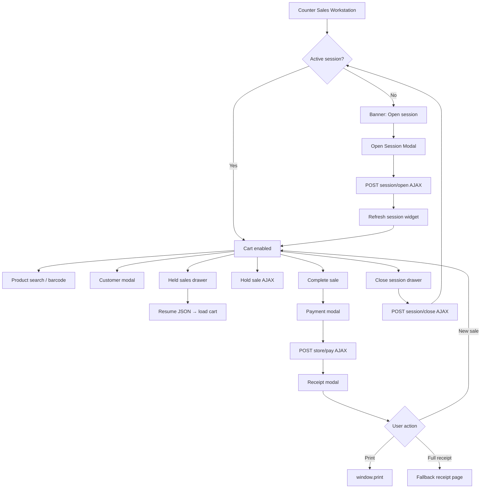

# PHASE POS-1C — Unified One-Page POS Workstation UX

## Readiness Table

| Module | Tables Affected | Routes Affected | Services Needed | Permissions Needed | Indexes Needed | Risks | Tests Required |
|--------|-----------------|-----------------|-----------------|-------------------|----------------|-------|----------------|
| Counter Sales Workstation | None (reuse `pos_sales`, `pos_sale_items`, `pos_sale_holds`, `pos_payments`, `pos_sessions`) | `admin.commercial.pos.counter-sales` + new AJAX routes under `pos/counter-sales/*`; existing full-page routes retained | `PosCounterSalesPresenter`, `PosProductSearchService`, `PosSaleService`, `PosSessionService`, `PosSessionVarianceService`, `PosCashReconciliationService` | `pos.counter_sales.view`, `pos.counter_sales.create`, `pos.counter_sales.hold`, `pos.counter_sales.complete`, `pos.counter_sales.cancel`, `pos.sessions.open`, `pos.sessions.close`, `pos.sessions.view`, `pos.receipts.reprint` (new) | None | Alpine/JS regressions; permission misconfiguration on AJAX endpoints; held-sale resume deep-link race | `PosCounterSalesUxTest`, updated `PosCounterSalesWorkstationTest`, `PosHeldSaleWorkflowTest` |

---

## Files Created

| File | Purpose |
|------|---------|
| `app/Support/Commercial/PosCounterSalesPresenter.php` | JSON payloads for session widget, close preview, held cart, held queue, receipt modal |
| `resources/views/admin/commercial/pos/partials/workstation/session-widget.blade.php` | Compact session status bar |
| `resources/views/admin/commercial/pos/partials/workstation/modals.blade.php` | Open session, payment, receipt, customer modals |
| `resources/views/admin/commercial/pos/partials/workstation/drawers.blade.php` | Close session and held-sales drawers |
| `tests/Feature/Commercial/PosCounterSalesUxTest.php` | AJAX/modal workflow feature tests |
| `docs/PHASE_POS1C_UNIFIED_POS_WORKSTATION.md` | This deliverable |

---

## Files Modified

| File | Change |
|------|--------|
| `app/Http/Controllers/Admin/Commercial/PosCounterSalesController.php` | Workstation config + JSON endpoints (session, hold, receipt) |
| `app/Http/Controllers/Admin/Commercial/PosSaleController.php` | JSON responses for store/pay/cancel; resume redirects to counter-sales |
| `resources/views/admin/commercial/pos/counter-sales.blade.php` | Single Alpine root `posCounterWorkstation` |
| `resources/views/admin/commercial/pos/partials/counter-sales-script.blade.php` | Fetch/AJAX workflow (no full-page redirects) |
| `routes/admin_commercial.php` | Counter-sales AJAX routes |
| `database/seeders/RolesAndPermissionsSeeder.php` | `pos.receipts.reprint` permission |
| `config/permission_catalog.php` | Catalog entry for reprint permission |
| `tests/Feature/Commercial/PosCounterSalesWorkstationTest.php` | Resume flow expects redirect + JSON payload |
| `tests/Feature/Commercial/PosHeldSaleWorkflowTest.php` | Resume flow updated for one-page UX |

---

## Routes Added

| Method | URI | Name | Purpose |
|--------|-----|------|---------|
| GET | `pos/counter-sales/session` | `admin.commercial.pos.counter-sales.session` | Session widget state |
| POST | `pos/counter-sales/session/open` | `admin.commercial.pos.counter-sales.session.open` | Open session (modal) |
| GET | `pos/counter-sales/session/close-preview` | `admin.commercial.pos.counter-sales.session.close-preview` | Close drawer expected totals |
| POST | `pos/counter-sales/session/close` | `admin.commercial.pos.counter-sales.session.close` | Close session with variance |
| GET | `pos/counter-sales/held-sales` | `admin.commercial.pos.counter-sales.held-sales` | Lazy-load held queue |
| GET | `pos/counter-sales/held-sales/{sale}/resume` | `admin.commercial.pos.counter-sales.held-sales.resume` | Resume cart JSON |
| GET | `pos/counter-sales/sales/{sale}/receipt` | `admin.commercial.pos.counter-sales.receipt` | Receipt modal payload |

**Retained fallback routes:** `pos.sessions.*`, `pos.receipt`, `pos.resume`, `pos.holds`, `pos.pay`, `pos.cancel`, etc.

---

## UI Components Added

- **Session widget** — top banner with open/close actions and live metrics
- **Alpine root** — `posCounterWorkstation` orchestrates all in-page interactions
- **Inline lock state** — cart disabled when no active session (`pos-counter--locked`)

---

## Modals Added

| Modal | Trigger | Actions |
|-------|---------|---------|
| Open Session | "Open session" button / no-session banner | Cashier, opening float, opening cash, notes → AJAX open |
| Payment | "Complete sale" | Method, amount, reference, change due → AJAX pay |
| Receipt | After successful payment | Print, reprint, new sale, full receipt link |
| Customer | Customer selector | Search/select walk-in or CRM customer |

---

## Drawers Added

| Drawer | Trigger | Actions |
|--------|---------|---------|
| Close Session | "Close session" on active session | Expected totals, actual cash, live variance, manager approval message |
| Held Sales Queue | "Held sales" toolbar button | Lazy-loaded list; resume/cancel without page leave |

---

## Tests Added

`tests/Feature/Commercial/PosCounterSalesUxTest.php`:

- Counter sales loads with no active session
- Open session modal endpoint works
- Session state updates after open
- Checkout blocked without active session (JSON 422)
- Payment completes sale and returns receipt payload
- Held sale created via JSON
- Held sale resume payload (no full page)
- Resume route redirects to counter-sales
- Close session preview + close endpoints
- Receipt payload endpoint
- Fallback full-page receipt still works
- Permission enforcement on session open

---

## Before vs After Workflow

### Before (page-based)

1. Cashier opens Counter Sales → blocked, link to Sessions page
2. Opens session on separate page → redirect back
3. Adds items, completes sale → redirect to receipt page
4. Held sale resume → full page reload with embedded form
5. Close session → separate sessions UI

### After (one-page workstation)

1. Cashier stays on `admin.commercial.pos.counter-sales`
2. No session → inline banner + **Open Session** modal (AJAX)
3. Session widget updates in place; cart unlocks
4. Complete sale → **Payment modal** → **Receipt modal** (optional full receipt)
5. Held sales → **drawer**; resume loads cart via JSON
6. Close session → **drawer** with live variance; no navigation

---

## Final POS One-Page Flow Diagram

---

## Architecture Notes

- **No database changes** — reuses POS-1A/1B schema and services
- **Presenter pattern** — `PosCounterSalesPresenter` centralizes workstation JSON
- **JSON contract** — `Accept: application/json` + CSRF on all AJAX calls
- **Performance** — held sales lazy-loaded; receipt loaded post-payment only; product search debounced 300ms
- **Permissions** — `pos.receipts.reprint` added for receipt modal reprint action

---

PRODUCTION GATE ARMORED:
STANDING BY FOR LEAN ENGINEERING INPUTS.
