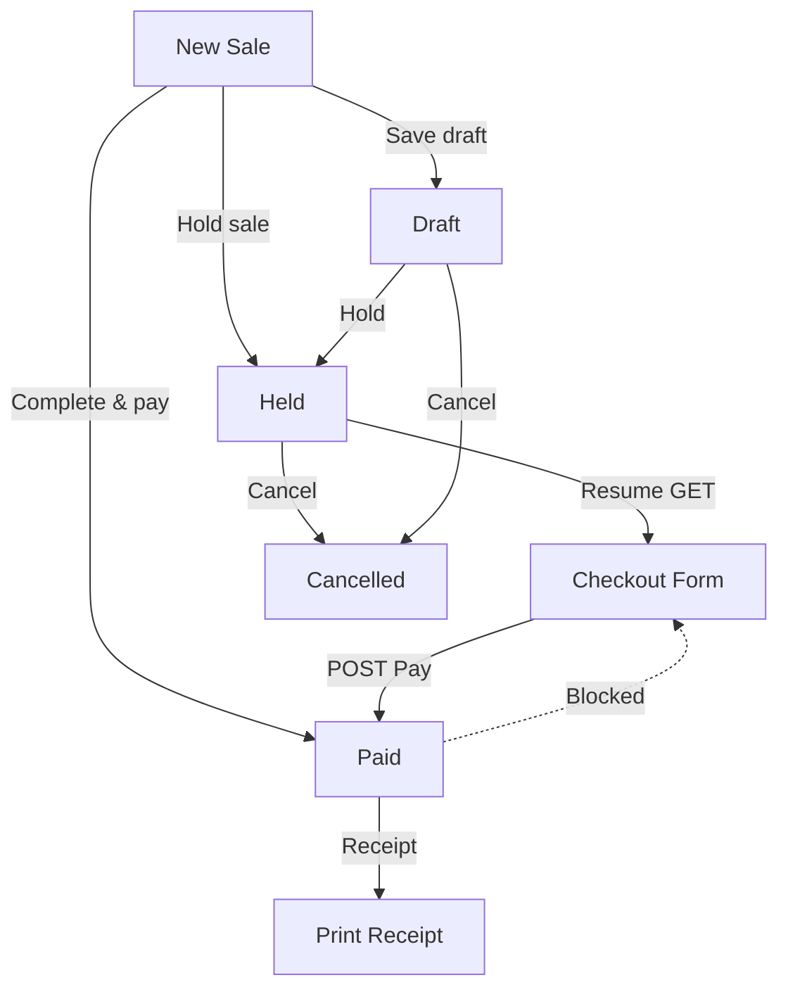

# PHASE POS-6B — Hold → Resume → Pay Workflow

## Implementation Report

**Mission:** Complete cashier held-sale workflow so held tickets can be resumed and paid without recreating the sale.

---

## Sale Status Flow

| Status | Transitions |
|--------|-------------|
| `draft` | Create (save) · Hold · Pay · Cancel |
| `held` | Resume → Pay · Cancel |
| `paid` | Receipt · Return · **Resume blocked** |
| `cancelled` | Terminal |
| `refunded` / `partially_refunded` | Via Returns module |

There is no `pending` status — held sales use `held`.

---

## Workflow Diagram



---

## Routes Added / Changed

| Method | URI | Name | Permission |
|--------|-----|------|------------|
| GET | `/admin/commercial/pos/sales/{sale}/resume` | `admin.commercial.pos.resume` | `pos.edit` |
| POST | `/admin/commercial/pos/sales/{sale}/pay` | `admin.commercial.pos.pay` | `pos.edit` |

**Changed:** `pos.resume` from POST redirect → GET checkout form.

---

## Rules Implemented

| Rule | Implementation |
|------|----------------|
| Dedicated Resume action | `GET pos.resume` loads checkout |
| Load customer, items, prices, discounts, taxes | `heldCartPayload()` + Alpine pre-fill |
| Pay without recreating sale | `payHeldSale()` updates same `pos_sales` row |
| Held → Paid conversion | Status update + payment sync + hold deleted |
| Block resume on Paid | `abort_unless(Held)` on resume/pay |
| Held sales queue on dashboard | Sale #, customer, created by, hold time, value |

---

## Files Changed

| File | Change |
|------|--------|
| `app/Support/Commercial/PosSaleService.php` | `payHeldSale()`, `assertHeld()` |
| `app/Http/Controllers/Admin/Commercial/PosSaleController.php` | `resume` GET, `pay` POST, dashboard queue |
| `resources/views/admin/commercial/pos/checkout.blade.php` | **New** — resume checkout |
| `resources/views/admin/commercial/pos/dashboard.blade.php` | Held sales queue table |
| `resources/views/admin/commercial/pos/holds.blade.php` | Resume link fixed |
| `resources/views/admin/commercial/pos/show.blade.php` | Resume & pay button |
| `routes/admin_commercial.php` | GET resume, POST pay |
| `tests/Feature/Commercial/PosHeldSaleWorkflowTest.php` | **New** — 5 tests |

---

## Tests

**File:** `tests/Feature/Commercial/PosHeldSaleWorkflowTest.php`

| Test | Coverage |
|------|----------|
| `test_create_hold` | Hold creates sale + hold record |
| `test_resume_hold_loads_checkout` | GET resume shows cart data |
| `test_pay_hold_converts_to_paid_without_new_sale` | Same sale ID, Paid, payment, hold removed |
| `test_prevent_resume_paid_sale` | 404 on resume/pay for Paid |
| `test_held_sales_queue_on_dashboard` | Queue visible on dashboard |

```bash
php artisan test --filter=PosHeldSaleWorkflowTest
```
